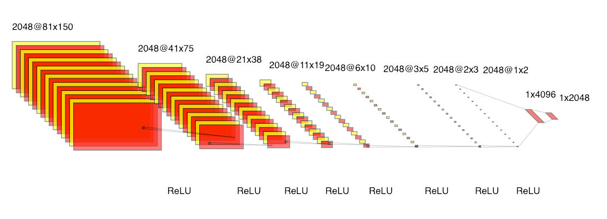

# Autoencoder convolutional neural network

Автокодировщик на основе CNN состоит из двух частей: энкодера и декодера.
* Энкодер превращает изображение в набор числовых признаков меньшего размера
* Дэкодер восстанавливает изображение из числовых признаков представленных энкодером

## Архитектура энкодера

## Построение модели

[Autoencoders.ipynb](Autoencoders.ipynb)

## Результаты

* CatBoost модель для предсказания [autoencoder_catboost.cbm](https://storage.yandexcloud.net/tnn-hse-medtech/models/autoencoder_catboost.cbm)
