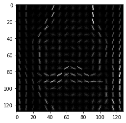

# Histogram oriented gradients

HOG, или Histogram of Oriented Gradients, это дескриптор признаков, который часто используется для извлечения признаков из изображения. Это широко используется в задачах компьютерного зрения. Этот метод подсчитывает появления градиентной ориентации в отдельных участках изображения

HOG дескриптор фокусируется на структуре или форме объекта. Для признаков границ мы только отмечаем, является ли данный пиксель границей или нет. HOG способен также предоставить направление границы. Это делается путем извлечения градиента и ориентации (или можно сказать мощность и направление) границ.

## Построение модели

[hog.ipynb](hog.ipynb)

## Результаты

* Датасет с HOG-дескрипторами и severity объектов для обучения
[train_data.csv.gz](https://storage.yandexcloud.net/tnn-hse-medtech/csv/train_data.csv.gz)
* CatBoost модель для предсказания [hog_cat_boost_v2.cbm](https://storage.yandexcloud.net/tnn-hse-medtech/models/hog_cat_boost_v2.cbm)
